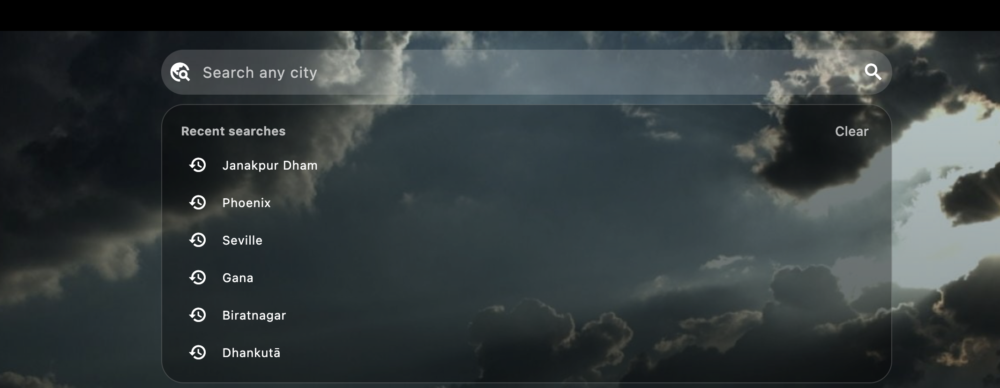
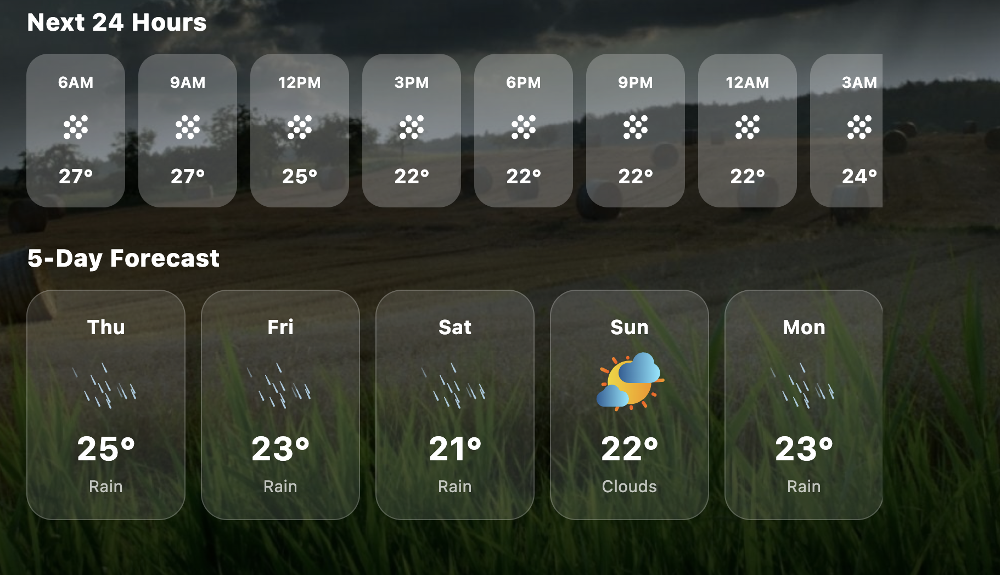
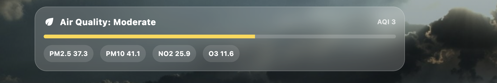
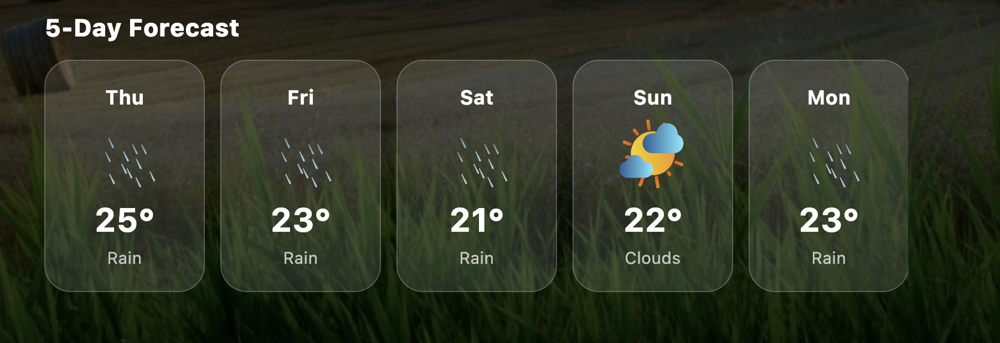
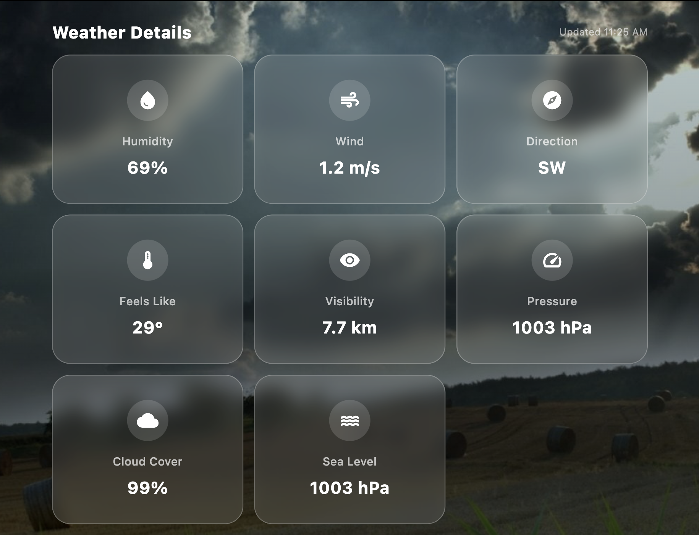
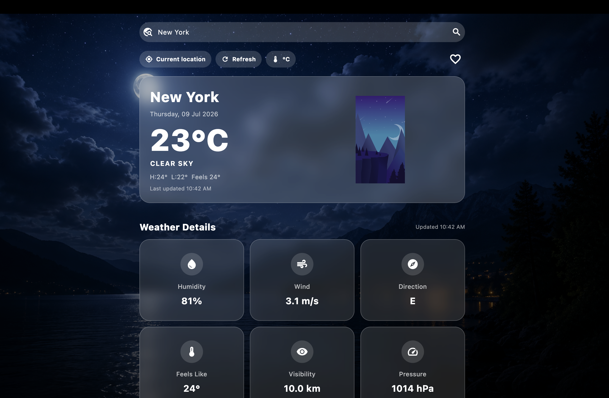

# 🌦️ Weather-APP

<p align="center">
  
  
  
  
  
</p>

<p align="center">
A modern Flutter Weather Application featuring real-time weather, hourly & 5-day forecasts, air quality, favorites, beautiful animations, and a clean responsive UI.
</p>

---

## 📱 Screenshots

| Home | Search |
|------|--------|
|  |  |

| Hourly Forecast | Air Quality |
|----------------|-------------|
|  |  |

| Favourites | Forecast |
|------------|----------|
|  |  |

| Weather | Night |
|---------|-------|
|  |  |

# ✨ Features

- 🌍 Search weather by city
- 📍 Current location weather
- 🌡️ Real-time temperature
- 💧 Humidity
- 🌬️ Wind Speed
- 🌤️ Weather Conditions
- 🕒 Hourly Forecast
- 📅 5-Day Forecast
- 🌫️ Air Quality Index (AQI)
- ⭐ Favorite Cities
- 🔎 Recent Searches
- 🎨 Beautiful Glassmorphism UI
- 🌅 Dynamic Weather Backgrounds
- 🎬 Lottie Weather Animations
- 📱 Responsive Design

---

# 🛠 Tech Stack

- Flutter
- Dart
- OpenWeatherMap API
- Geolocator
- HTTP
- Shared Preferences
- Lottie Animations

---

# 📂 Project Structure

```text
lib/
│
├── models/
├── screens/
├── services/
├── utils/
├── widgets/
└── main.dart
```

---

# 🚀 Getting Started

### Clone Repository

```bash
git clone https://github.com/iamkabir12/Weather-APP.git
```

```bash
cd Weather-APP
```

### Install Packages

```bash
flutter pub get
```

### Add Your API Key

Replace

```dart
YOUR_API_KEY
```

with your own OpenWeatherMap API key.

### Run

```bash
flutter run
```

---

# 📦 Dependencies

- http
- geolocator
- intl
- shared_preferences
- lottie

---

# 🔮 Future Improvements

- 🌙 Dark Mode
- 📍 Weather Maps
- 🌎 Multiple Language Support
- 📈 Weather Charts
- ⛈ Severe Weather Alerts
- 🔔 Notifications
- 📡 Offline Cache

---

# 👨‍💻 Developer

**Kabir Pandey**

Computer Science Engineering Student

Flutter Developer • AI Enthusiast • Full Stack Learner

GitHub:
https://github.com/iamkabir12

---

## ⭐ Support

If you found this project helpful, consider giving it a ⭐ on GitHub.
